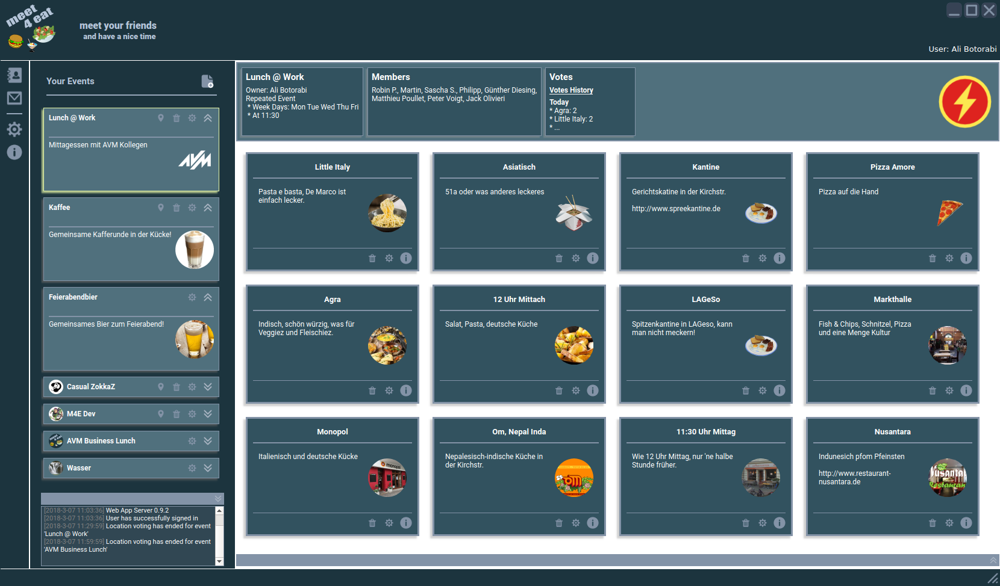
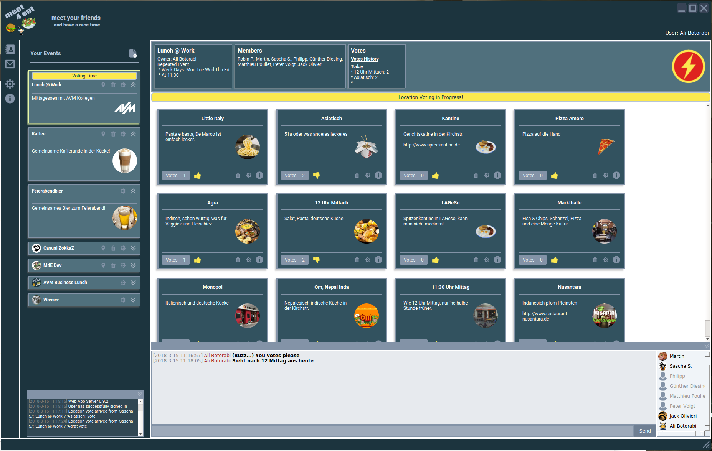

---
# You don't need to edit this file, it's empty on purpose.
# Edit theme's home layout instead if you wanna make some changes
# See: https://jekyllrb.com/docs/themes/#overriding-theme-defaults
layout: default
---
<h1><image src="/favicon.png"/> Meet4Eat </h1>

**Meet4Eat** is a social collaboration application providing an easy way to communicate with your colleagues and friends to make an appointment for a social event such as meeting for daily lunch.

This project provides a Qt based desktop client for Meet4Eat. The Meet4Eat web application is developed in an own project [Meet4Eat Web Application https://github.com/botorabi/Meet4Eat](https://github.com/botorabi/Meet4Eat).

The client is available for MS Windows, Linux, and MacOS. Installable packages can be downloaded from [Meet4Eat site https://m4e.org](https://m4e.org).

**Here are a few screenshots showing the desktop client.** 
 
 
 
